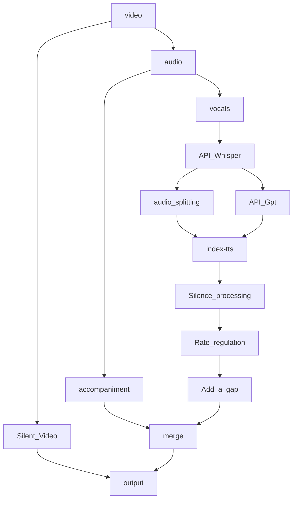

## API

The API section mainly uses Cloudflare to run Whisper and GPT, which then passes the data to index-tts before finally merging the content.

Ideally, the code should be structured around index-tts as the core, splitting it into video decomposition and subsequent merging stages. This is because most of the code runs on the CPU, while only index-tts requires a GPU.

### 🛠️ The problem of usage
- API failures require re-importing the API variables.

- When splitting audio based on API_Whisper, some segments may have a duration near zero. This results in empty files that trigger index-tts errors. These specific audio files must be handled manually before using the script to proceed with subsequent operations.
  - Optimal manual audio processing duration < Current duration + Interval between sections;
  - Otherwise, it will terminate when the gap becomes negative.
  - Alternatively, if the duration is too short for the model to mimic, use the previous audio for imitation instead.
  - The corresponding values in the script must be modified based on the time_period_list, ts_texts provided in main, and the current paragraph count.

### Workflow
   <!--machine-learning-->
